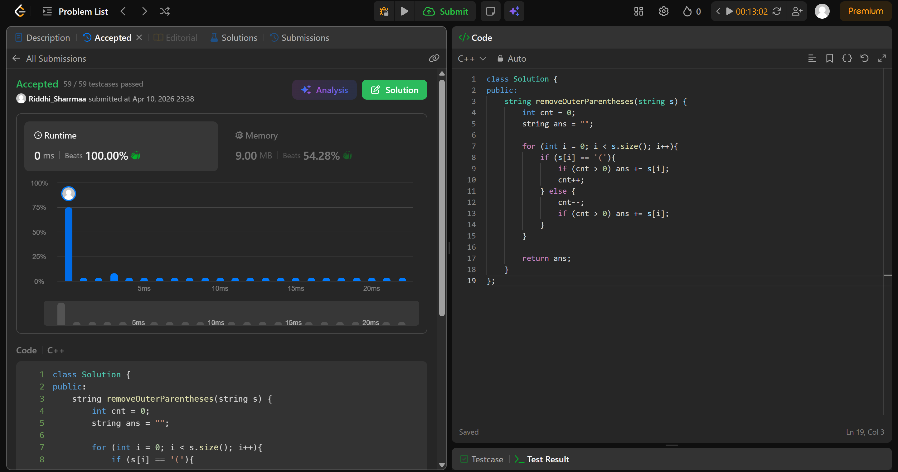

# 1021. Remove Outermost Parentheses

## Problem Description

A valid parentheses string is either empty "", "(" + A + ")", or A + B, where A and B are valid parentheses strings, and + represents string concatenation.

For example, "", "()", "(())()", and "(()(()))" are all valid parentheses strings.
A valid parentheses string s is primitive if it is nonempty, and there does not exist a way to split it into s = A + B, with A and B nonempty valid parentheses strings.

Given a valid parentheses string s, consider its primitive decomposition: s = P1 + P2 + ... + Pk, where Pi are primitive valid parentheses strings.

Return s after removing the outermost parentheses of every primitive string in the primitive decomposition of s.

## Approach

* we traverse the string and use a cnt variable
* if char is ( and cnt > 0, just add to ans, because we know there is an opening paranthesis present and this is not that one
* increase cnt
* similarly if char is ) and cnt > 0 add to ans
* decrease cnt
* return ans

## Time & Space Complexity

* **Time:** O(n)
* **Space:** O(1)
