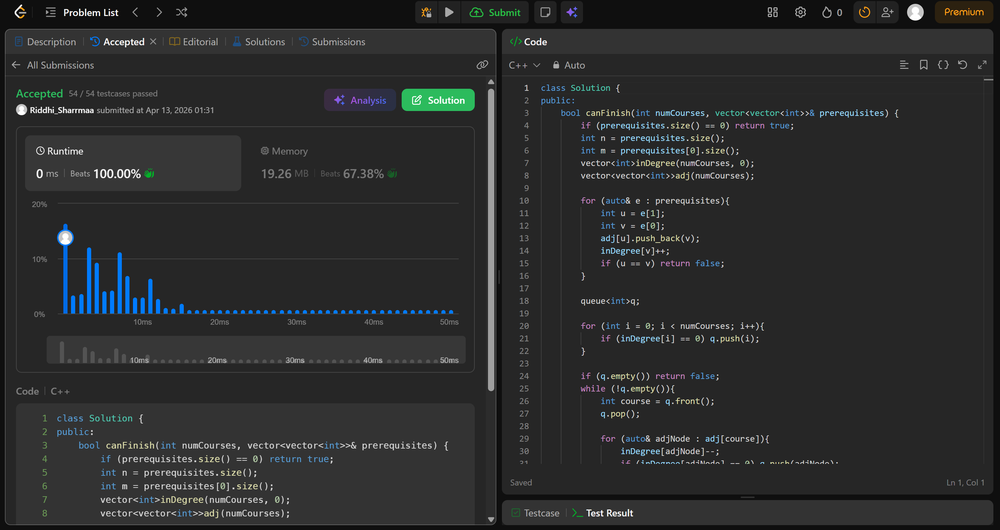

# 7207. Course Schedule

## Problem Description

There are a total of numCourses courses you have to take, labeled from 0 to numCourses - 1. You are given an array prerequisites where prerequisites[i] = [ai, bi] indicates that you must take course bi first if you want to take course ai.

For example, the pair [0, 1], indicates that to take course 0 you have to first take course 1.
Return true if you can finish all courses. Otherwise, return false.

## Approach

we use *topo sort* in this question

* make an adjacency matrix and an inDegree vector
* push all courses with inDegree = 0 into queue
* iterate over courses in queue and decrease the node they're pointing to's inDegree
* if it becomes 0 push into queue
* at the end iterate oevr inDegree vector again and check if any course's inDegree is > 0, if so return false
* return true

## Time & Space Complexity

* **Time:** O(v + e)
* **Space:** O(v + e)
