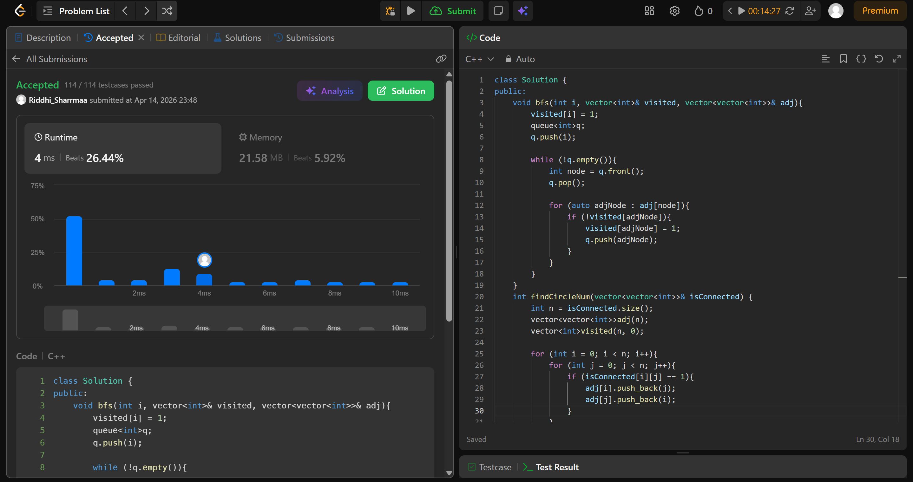

# 547. Number of Provinces

## Problem Description

There are n cities. Some of them are connected, while some are not. If city a is connected directly with city b, and city b is connected directly with city c, then city a is connected indirectly with city c.

A province is a group of directly or indirectly connected cities and no other cities outside of the group.

You are given an n x n matrix isConnected where isConnected[i][j] = 1 if the ith city and the jth city are directly connected, and isConnected[i][j] = 0 otherwise.

## Approach

we use *bfs* in this question

* make a adjacency vector and visited vector
* call bfs every time we have an unvisited node
* increase count for each call
* return count

## Time & Space Complexity

* **Time:** O(v + e) + O(n^2) [building adj]
* **Space:** O(v + e)
