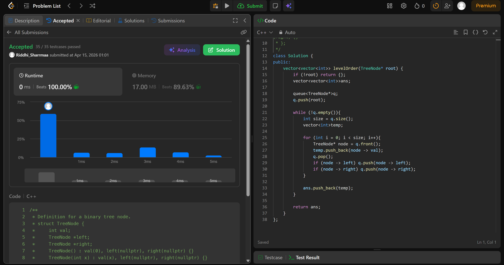

# 102. Binary Tree Level Order Traversal

## Problem Description

Given the root of a binary tree, return the level order traversal of its nodes' values. (i.e., from left to right, level by level).

## Approach

we use *bfs* in this question

* make a queue and ans vector
* push the first node
* iterate till queue is empty
* initialise size as the size of queue and make a temp vector
* iterate a for loop from 0 to size, push node -> val in the temp vector, pop queue
* if node -> left push it, if node -> right, push it
* push temp in ans vector
* return ans

## Time & Space Complexity

* **Time:** O(n)
* **Space:** O(n)
