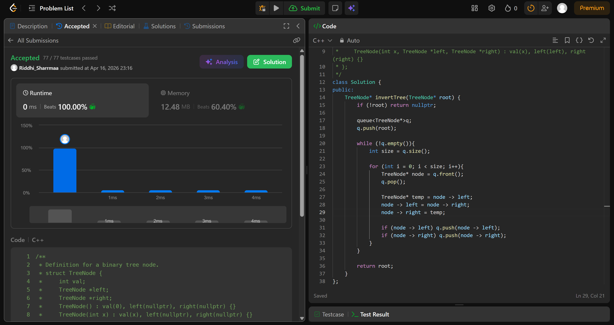

# 226. Invert Binary Tree

## Problem Description

Given the root of a binary tree, invert the tree, and return its root.

## Approach

we use *bfs* in this question

* make a queue
* push the first node
* iterate till queue is empty
* initialise size as the size of queue and make a temp vector
* iterate a for loop from 0 to size, pop node
* swap left and right children of node
* if node -> left push it, if node -> right, push it
* return root

## Time & Space Complexity

* **Time:** O(n)
* **Space:** O(n)
