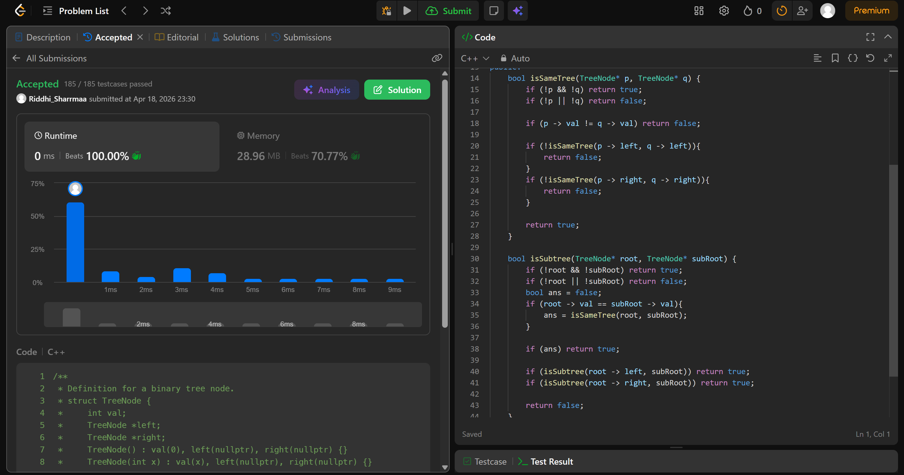

# 572. Subtree of Another Tree

## Problem Description

Given the roots of two binary trees root and subRoot, return true if there is a subtree of root with the same structure and node values of subRoot and false otherwise.

A subtree of a binary tree tree is a tree that consists of a node in tree and all of this node's descendants. The tree tree could also be considered as a subtree of itself.

## Approach

* recursively check left and right nodes if they have same val
* if val is same then call isSameTree func
* in isSameTree if val of nodes is diff, return false
* recursively check left and right nodes
* if at any point node val is diff, return false

## Time & Space Complexity

* **Time:** O(n*m)
* **Space:** O(h)
