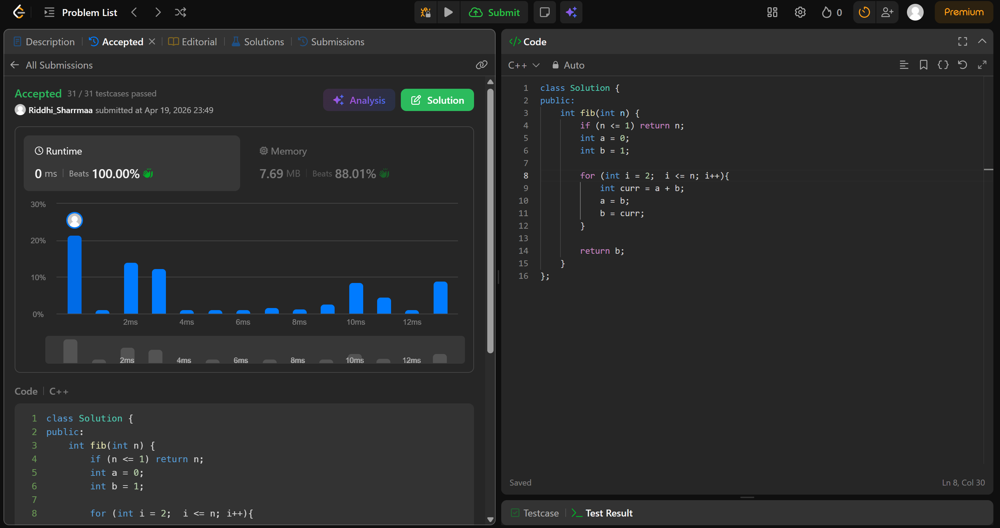

# 509. Fibonacci Number

## Problem Description

The Fibonacci numbers, commonly denoted F(n) form a sequence, called the Fibonacci sequence, such that each number is the sum of the two preceding ones, starting from 0 and 1. That is,

F(0) = 0, F(1) = 1
F(n) = F(n - 1) + F(n - 2), for n > 1.
Given n, calculate F(n).

## Approach

* intialise a = 0 and b = 1
* iterate till = n and keep adding last 2 nums
* update a = b and b = curr sum
* return b

## Time & Space Complexity

* **Time:** O(n)
* **Space:** O(1)
