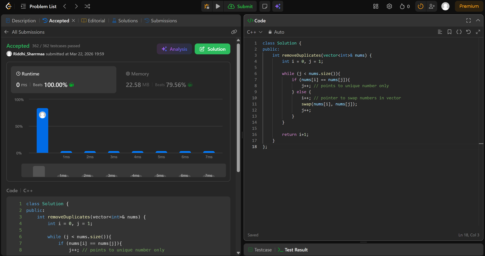

# 26. Remove Duplicates from Sorted Array

---

## Problem Description

Given an integer array nums sorted in non-decreasing order, remove the duplicates in-place such that each unique element appears only once. The relative order of the elements should be kept the same.

Consider the number of unique elements in nums to be k​​​​​​​​​​​​​​. After removing duplicates, return the number of unique elements k.

The first k elements of nums should contain the unique numbers in sorted order. The remaining elements beyond index k - 1 can be ignored.

---

## Approach

We use  *two pointers* in thiq question.

* initialise i and j as 0 and 1
* i is used for keeping track idx in vector which has to be swapped
* j is used for finding the unique number
* we traverse the vector and if i and j idx have same number, we move j forward(its in search of unique num)
* and when we do find unique num, we move i forward(the next idx is the place where we have to swap)
* then we swap and move j forward
* return i+1 at end

---

## Time & Space Complexity

* **Time:** O(n)
* **Space:** O(1)

