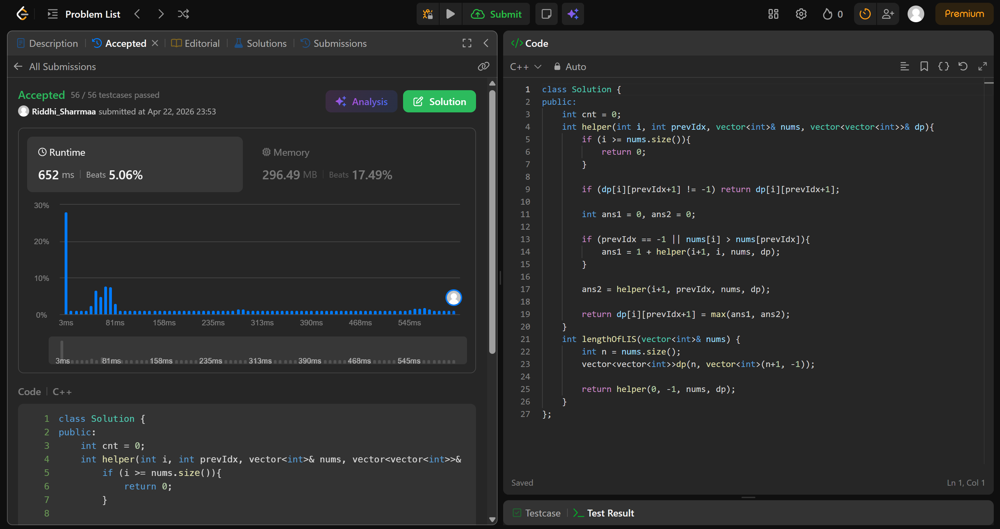

# 300. Longest Increasing Subsequence

## Problem Description

Given an integer array nums, return the length of the longest strictly increasing subsequence.

## Approach

* Define state helper(i, prevIdx) = LIS starting from index i with last picked index prevIdx
* At each i, you have two choices: take nums[i] or skip it
* Take only if prevIdx == -1 or nums[i] > nums[prevIdx]
* max(1 + helper(i+1, i), helper(i+1, prevIdx))
Use memoization dp[i][prevIdx+1] and start from helper(0, -1)

## Time & Space Complexity

* **Time:** O(n)
* **Space:** O(n)
