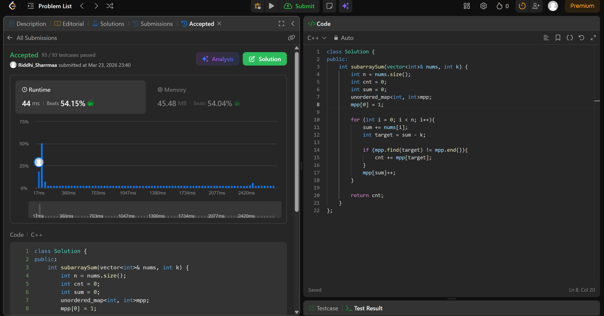

# 560. Subarray Sum Equals K

## Problem Description

Given an array of integers nums and an integer k, return the total number of subarrays whose sum equals to k.

A subarray is a contiguous non-empty sequence of elements within an array.

## Approach

We use  *prefix sum* in this question.

* we know that if we calc prefix sum, then if prefix_sum(till j) - prefix_sum(till i) = k, the sum of subarray from i+1 -> j = k
* taking adv of this property, if we rearrange the eqn a little we see => 
prefix_sum(till i) = prefix_sum(till j) - k
* if we keep track of the curr sum as well as all the past prefix sums, we can find at any idx whether the complement of that sum exists
* simply add the count to ans
* return total count 

## Time & Space Complexity

* **Time:** O(n)
* **Space:** O(n)

