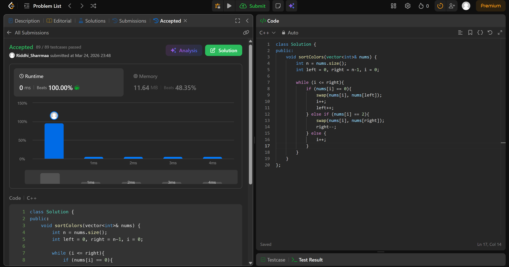

# 560. Subarray Sum Equals K

## Problem Description

Given an array nums with n objects colored red, white, or blue, sort them in-place so that objects of the same color are adjacent, with the colors in the order red, white, and blue.

We will use the integers 0, 1, and 2 to represent the color red, white, and blue, respectively.

You must solve this problem without using the library's sort function.

## Approach

We use  *2 pointers* in this question.

* we use a variable i to decide what to swap
* basically if we make it so that all 0's go to left and 2's to right, 1's will be automatically present in the middle
* so left is used to keep track of 0's and right for 2's
* when nums[i] == 0, we swap with left and increase left and i
* if nums[i] == 2, we swap with right and decrease right
* if nums[i] == 1, we simply move ahead

## Time & Space Complexity

* **Time:** O(n)
* **Space:** O(1)

