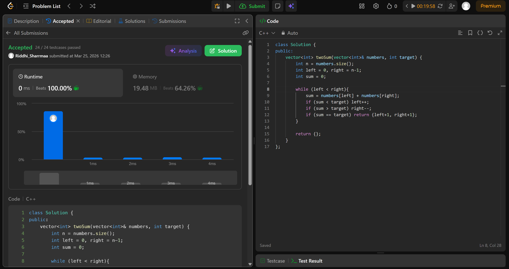

# 560. Subarray Sum Equals K

## Problem Description

Given a 1-indexed array of integers numbers that is already sorted in non-decreasing order, find two numbers such that they add up to a specific target number. Let these two numbers be numbers[index1] and numbers[index2] where 1 <= index1 < index2 <= numbers.length.

Return the indices of the two numbers index1 and index2, each incremented by one, as an integer array [index1, index2] of length 2.

The tests are generated such that there is exactly one solution. You may not use the same element twice.

Your solution must use only constant extra space.

## Approach

We use  *two pointers* in this question.

* we initialise left = 0 and right = n-1
* the approach is simple, since the array is sorted
* if nums[left] + nums[right] > target, we have decrease right, as we are moving towards a lower number, hence decreasing the sum
* if nums[left] + nums[right] < target, we increase left, as we are moving towards a higher number, hence increasing the sum
* when nums[left] + nums[right] == target, we can simply return by increasing the indices by 1

## Time & Space Complexity

* **Time:** O(n)
* **Space:** O(1)

