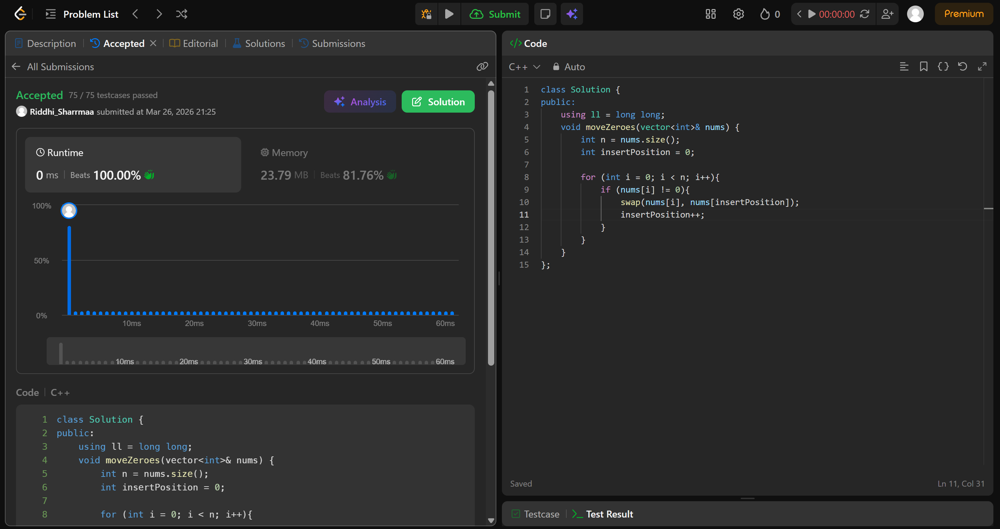

# 283. Move Zeroes

## Problem Description

Given an integer array nums, move all 0's to the end of it while maintaining the relative order of the non-zero elements.

Note that you must do this in-place without making a copy of the array.

## Approach

* we just need a variable to point to the idx where the next non-zero number should go to
* the idea is to move the non zero elements to the front rather than trying to shift the zeroes to back (its a mental shift, although zeroes will be shifted to back nonetheless thoguth through this method)
* as soon as you encounter a number which is not zero, swap with the the idx where insertPosition points to

## Time & Space Complexity

* **Time:** O(n)
* **Space:** O(1)

