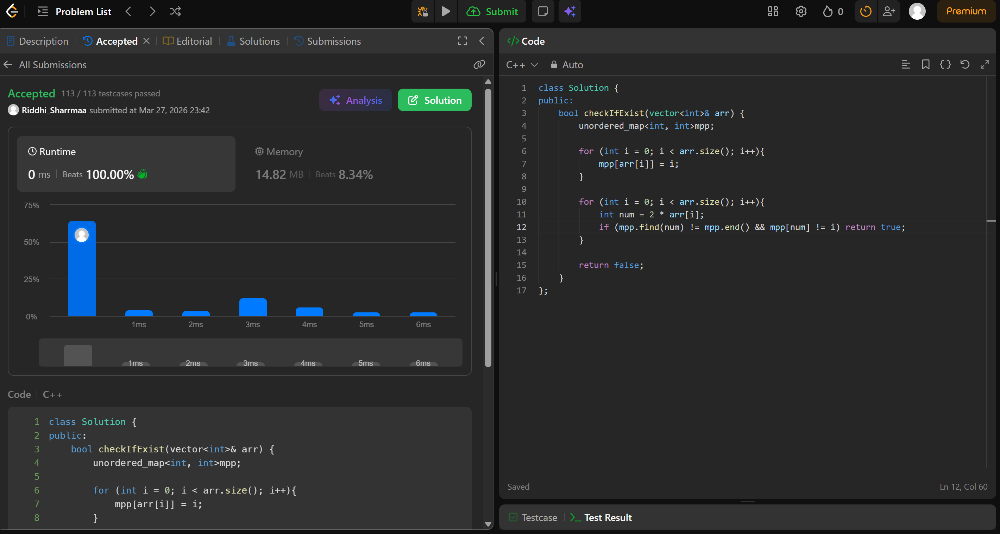

# 1346. Check If N and Its Double Exist

## Problem Description

Given an array arr of integers, check if there exist two indices i and j such that :

i != j
0 <= i, j < arr.length
arr[i] == 2 * arr[j]

## Approach

* we use a hashmap to store all numbers with their indices
* then we iterate over the array and check if double of number exists and whether its index is diff or not
* if it exists and is diff, return true
* else return false

## Time & Space Complexity

* **Time:** O(n)
* **Space:** O(n)

