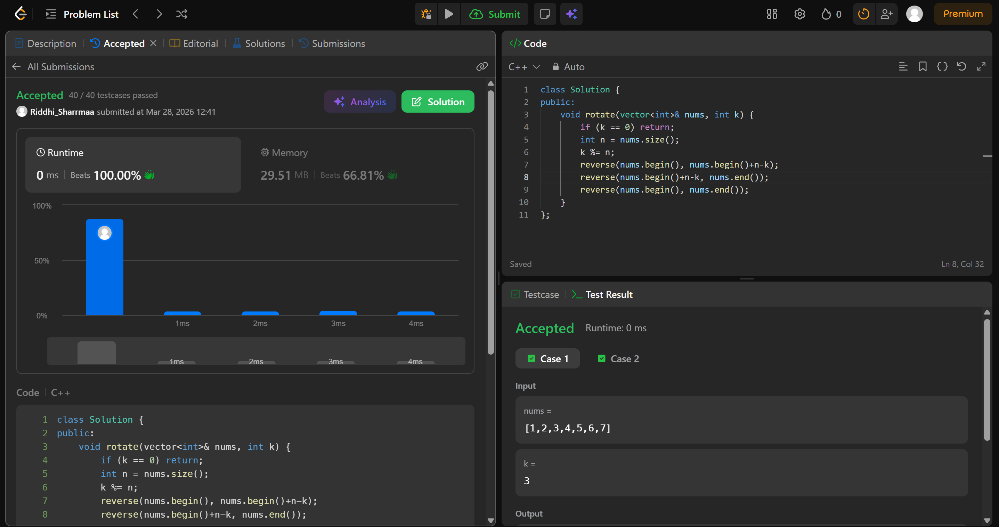

# 189. Rotate Array

## Problem Description

Given an integer array nums, rotate the array to the right by k steps, where k is non-negative.

## Approach

* we use reverse function to rotate array inplace without using extra space
* first we reverse n-k elements, then the rest of the elements
* then we reverse the whole array, finally getting an array which is right rotated by k

## Time & Space Complexity

* **Time:** O(n)
* **Space:** O(1)

