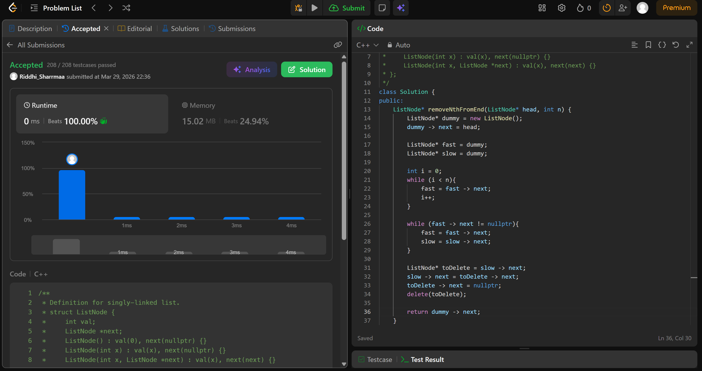

# 19. Remove Nth Node From End of List

## Problem Description

Given the head of a linked list, remove the nth node from the end of the list and return its head.

## Approach

* we use 2 pointers(fast and slow) to delete nth node from end
* we create a dummy node whose next points to head, so that we have track of head at all times
* both fast and slow point to the dummy node
* now we move fast n times
* then we move both fast and slow till fast is at the last node
* the idea is that fast and slow always have a gap of n between them, so when fast is at last node, slow will be at n-1th node from end
* so we can easily access the nth node by slow -> next and delete it
* handle connections properly

## Time & Space Complexity

* **Time:** O(n)
* **Space:** O(1)

