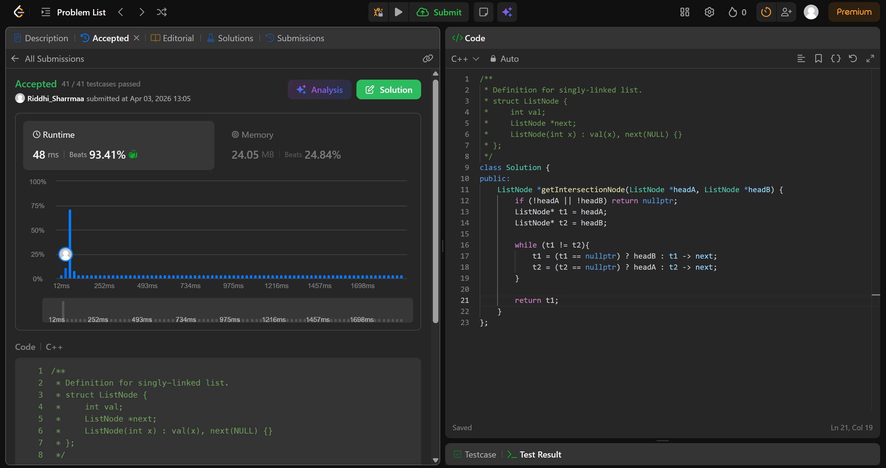

# 160. Intersection of Two Linked Lists

## Problem Description

Given the heads of two singly linked-lists headA and headB, return the node at which the two lists intersect. If the two linked lists have no intersection at all, return null.

The test cases are generated such that there are no cycles anywhere in the entire linked structure.

Note that the linked lists must retain their original structure after the function returns.

## Approach

* we make 2 pointers point to both lists
* we will simulate basically the end of 1 list getting connected to the head of the second list(forming a cycle) and then detecting the cycle
* since we know that total number of steps from headA to intersection (headA -> intersection -> end of listA -> headB -> intersection) is the same as the number of steps from headB to intersection (headB -> intersection -> end of ListB -> headA -> intersection)
* we will traverse the list, when either t1 or t2 becomes null, we make it point to the head of the other list, since total number of steps is same (2+3 = 5 and 3 + 2 = 5)
* they will coincide at the intersection

## Time & Space Complexity

* **Time:** O(n+m)
* **Space:** O(1)
