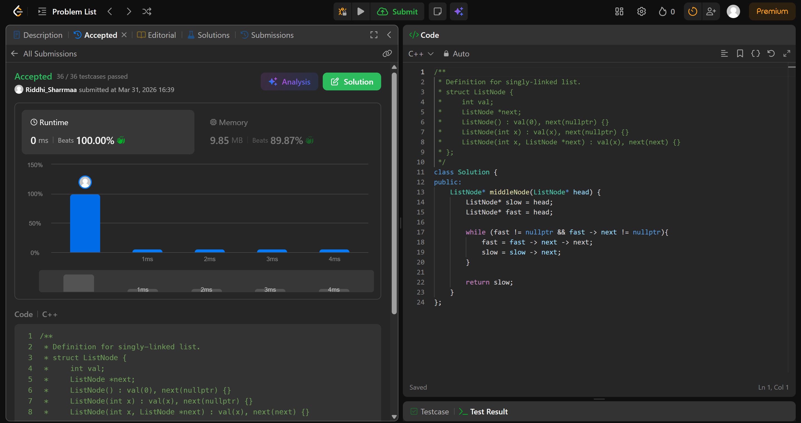

# 876. Middle of the Linked List

## Problem Description

Given the head of a singly linked list, return the middle node of the linked list.

If there are two middle nodes, return the second middle node.

## Approach

* we use 2 pointers to find the middle of the linked list
* fast moves 2 steps at a time and slow moves only 1 step at a time
* since fast is moving faster, it would eventually become null
* fast is moving at 2x speed of slow
* so when fast or fast-> next hits nulls, slow is at the middle

## Time & Space Complexity

* **Time:** O(n)
* **Space:** O(1)
