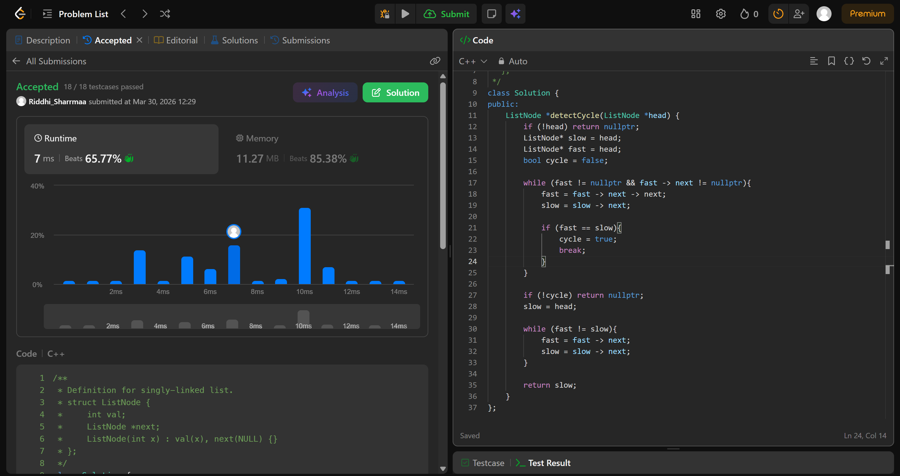

# 142. Linked List Cycle II

## Problem Description

Given the head of a linked list, return the node where the cycle begins. If there is no cycle, return null.

There is a cycle in a linked list if there is some node in the list that can be reached again by continuously following the next pointer. Internally, pos is used to denote the index of the node that tail's next pointer is connected to (0-indexed). It is -1 if there is no cycle. Note that pos is not passed as a parameter.

Do not modify the linked list.

## Approach

* we use tortoise-hare approach to detect a cycle in the linked list
* in this we have 2 pointers fast and slow, fast moves 2 steps at a time and slow moves only 1 step at a time
* basically if there was no cycle, since fast is moving faster, it would eventually become null and hence, no cycle -> return nullptr
* but if it never becomes null, means it is stuck in a loop and it eventually coincides with slow, this would be our **meeting point**
* now we make slow point to head and we move both fast and slow only 1 step at a time, when they meet, that node is the start of the cycle
* why though?  because lets say 
1. a = dist from head to start of cycle
2. b = dist from start of cyle to meeting point
3. c = dist from meeting point to start of cycle

* now dist travelled by fast = a + b + c + b and dist travelled by slow = a + b
* we know that fast travelled twice of slow since it was moving at 2x speed
* so a + b + c + b = 2 (a + b)
* expanding we see a + b + c + b = a + a + b + b
* hence a = c
*so when fast and slow meet, if slow is made to point to head again, the dist it moves from head to start of cycle is equal to the dist that fast moves from meeting point to start of cycle

## Time & Space Complexity

* **Time:** O(n)
* **Space:** O(1)

