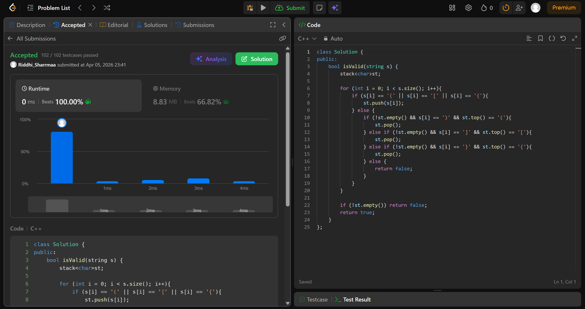

# 20. Valid Parentheses

## Problem Description

Given a string s containing just the characters '(', ')', '{', '}', '[' and ']', determine if the input string is valid.

An input string is valid if:

Open brackets must be closed by the same type of brackets.
Open brackets must be closed in the correct order.
Every close bracket has a corresponding open bracket of the same type.

## Approach

* we use a stack to store the elements
* if char is an opening bracket, we push it
* if its a closing bracket, we check if the top is the corresponding closing bracket
* if not return false
* return true

## Time & Space Complexity

* **Time:** O(n)
* **Space:** O(n)
