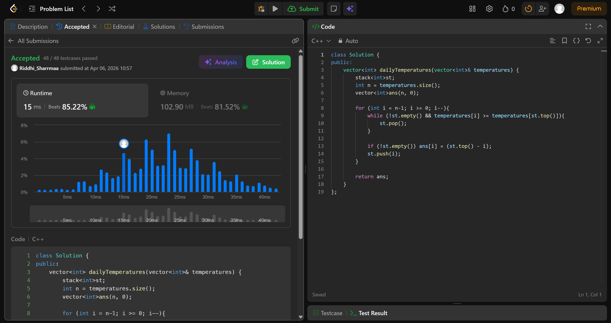

# 739. Daily Temperatures

## Problem Description

Given an array of integers temperatures represents the daily temperatures, return an array answer such that answer[i] is the number of days you have to wait after the ith day to get a warmer temperature. If there is no future day for which this is possible, keep answer[i] == 0 instead.

## Approach

* intialise answer array of size n and all ele = 0
* we iterate the array from n-1 to 0 
* store the idx of element in the stack if the stack is empty or the element is greater than the top
* keep popping the stack if the top is smaller than the element, so as to insure that at that idx, we get the idx of the next greatest temperature
* update ans if stack is not empty
* push current element idx onto stack
* return ans

## Time & Space Complexity

* **Time:** O(n)
* **Space:** O(n)
