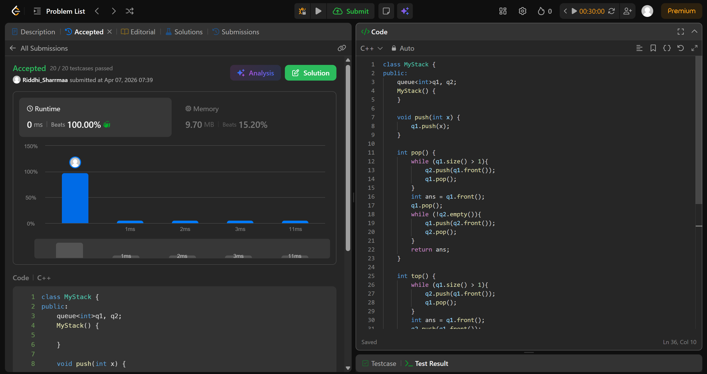

# 739. Daily Temperatures

## Problem Description

Implement a last-in-first-out (LIFO) stack using only two queues. The implemented stack should support all the functions of a normal stack (push, top, pop, and empty).

Implement the MyStack class:

void push(int x) Pushes element x to the top of the stack.
int pop() Removes the element on the top of the stack and returns it.
int top() Returns the element on the top of the stack.
boolean empty() Returns true if the stack is empty, false otherwise.

Notes:
* You must use only standard operations of a queue, which means that only push to back, peek/pop from front, size and is empty operations are valid.
* Depending on your language, the queue may not be supported natively. You may simulate a queue using a list or deque (double-ended queue) as long as you use only a queue's standard operations.

## Approach

* we use two queues to act as a stack
* when we have to push, we simply push into q1
* when we have to top, we send all elements from q1 to q2, except the last one(rear)
* then we store it as ans and send it to q2 as well
* we send back all the elements from q2 to q1 
* return ans
* similarly, in pop, rather than sending the last element we remove it from queue
* in empty, we check whether q1 is empty or not

## Time & Space Complexity

* **Time:** O(n)
* **Space:** O(n)
