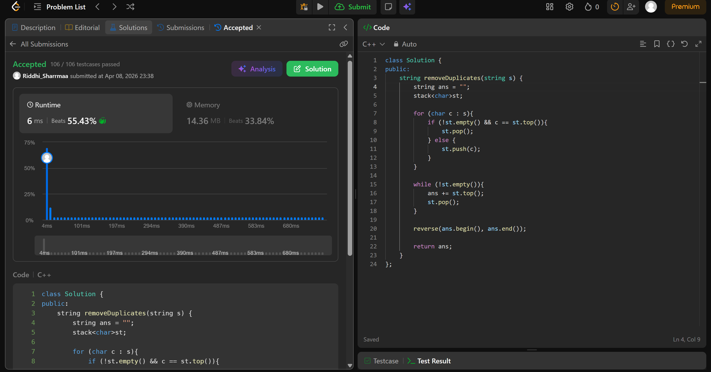

# 1047. Remove All Adjacent Duplicates In String

## Problem Description

You are given a string s consisting of lowercase English letters. A duplicate removal consists of choosing two adjacent and equal letters and removing them.

We repeatedly make duplicate removals on s until we no longer can.

Return the final string after all such duplicate removals have been made. It can be proven that the answer is unique.

## Approach

* we use a stack to remove duplicates
* if top is same as the char we iterating through, we pop the stack
* else we push it
* store string in ans, reverse it
* return ans

## Time & Space Complexity

* **Time:** O(n)
* **Space:** O(n)
