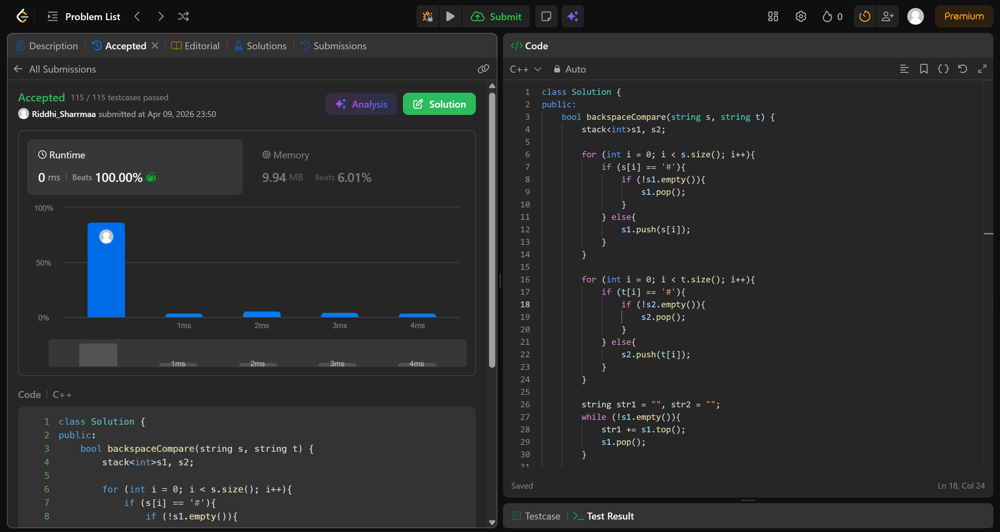

# 844. Backspace String Compare

## Problem Description

Given two strings s and t, return true if they are equal when both are typed into empty text editors. '#' means a backspace character.

Note that after backspacing an empty text, the text will continue empty.

## Approach

* we use 2 stacks
* push char if its not '#'
* if its '#', pop it
* push all char left in both stacks to str1 and str2
* compare strings and return true if both are same

## Time & Space Complexity

* **Time:** O(n)
* **Space:** O(n)
